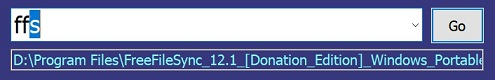
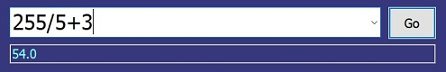

# ReTAR
一个基于 AHKv2 的简单启动器

## 名字来历：
 
 曾经有一个快速启动软件叫做 TypeAndRun，我大概用了有十几年。这软件特别符合我的使用习惯，但有一个问题就是经常会丢失配置，而且从 201x 年起就已经不再更新了（有个 repo 好像是它的源代码 https://github.com/codeleventh/typeandrun） 也试用过很多其他快速启动软件，但都找不回那种感觉。
 
 2015 年的某天，产生了想自己写一个的想法，但苦于不会编程，研究了一阵 python 就放弃了。直到 2022 年夏天，重新捡起了这个想法，用 AHK 慢慢的从零开始一步步的搭建出了基本功能。2023 年又用  AHKv2 进行了重构。为了纪念 TypeAndRun，就起名叫做 ReTAR。
 
## 首次运行：
首次运行会自动在目录下生成 Config.ini，可修改此文件加入自己的配置，格式如下：
```
[ev]
path=D:\Program Files\Everything-1.4.1.1004.x64\Everything.exe

[cmd]
path=cmd
```
方括号中为自定义的关键字，"path=" 后跟路径。

默认呼出热键 <kbd>~</kbd> ,就是 <kbd>Esc</kbd> 下面那个键，如欲更改，请修改代码第71行，快捷键定义可查看 AHK 文档。

## 用法
- 热键呼出界面，输入预定义的关键字（可自动补全），回车运行
- 输入算式自动计算，回车将结果复制到剪贴板，
- 在文件关闭/打开对话框中按 <kbd>ctrl</kbd>+<kbd>g</kbd> 呼出菜单，显示当前打开的目录，点击可跳转（具体见 https://github.com/fffb/FolderMenuList）
- 系统托盘右键菜单可设置开机启动
- config.ini 中的 [Count]字段下会简单记录每个关键字运行的次数（暂时没找到更优雅的办法，凑合用）

## 截图


